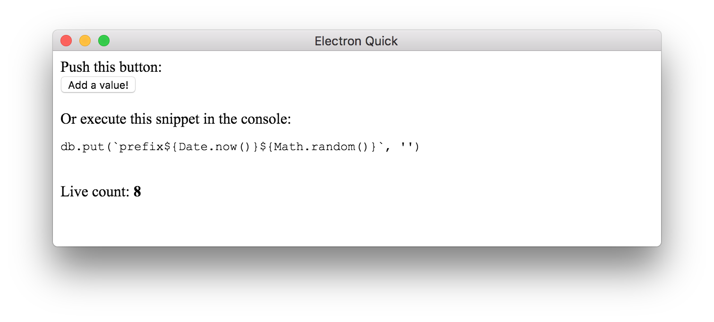

# react-level-count

Live updating [leveldb](https://leveldb.org) + [react](https://reactjs.org/) component for counting the k/v pairs under a prefix!

## Example

```js
import React from 'react'
import level from 'level'
import { Count } from 'react-level-count'

const db = level('/tmp/react-level-count')

class Example extends React.Component {
  render () {
    return (
      <div>
        Live count: <Count db={db} prefix="prefix" />
      </div>
    )
  }
}
```

Now the `<Count />` component will always reflect the number of k/v pairs you have stored in your database with the prefix `prefix`.

Find a full example in [/example](example):

```bash
$ npm install
$ npm run rebuild
$ npm start
```



## Installation

```bash
$ npm install react-level-value
```

## API

### `<Count db [prefix filter render] />`

Use `filter` to pick what adds to the count, like so:

```js
<Count
  db={db}
  filter={({ key, value }) => true}
/>
```

Use `render` for a custom render function:

```js
<Count
  db={db}
  prefix="prefix"
  render={count => <strong>{count}</strong>}
/>
```

## License

MIT
